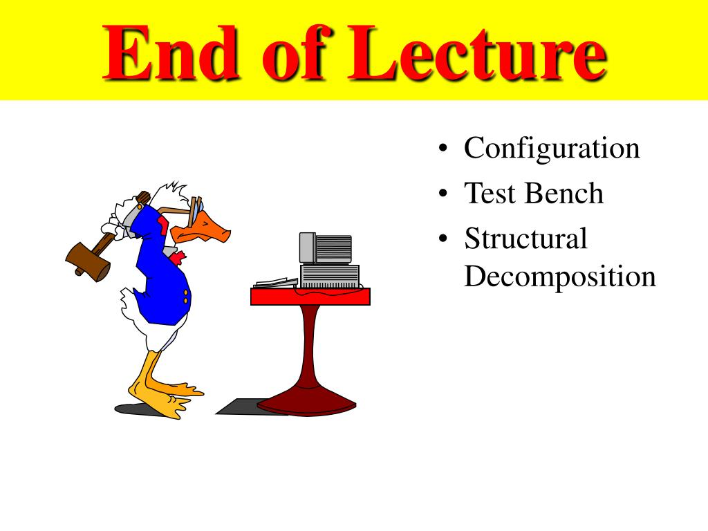

# Java script Mathod Strings 
 
# 1.Method Char At

``` js
const sentence = 'The quick brown fox jumps over the lazy dog.';

const index = 4;

console.log(`The character at index ${index} is ${sentence.charAt(index)}`);
// Expected output: "The character at index 4 is q"
```

# 2.Method concat

```js
const hello = "Hello, ";
console.log(hello.concat("Kevin", ". Have a nice day."));
// Hello, Kevin. Have a nice day.

      const greetList = ["Hello", " ", "Venkat", "!"];
"".concat(...greetList); // "Hello Venkat!"

"".concat({}); // "[object Object]"
"".concat([]); // ""
"".concat(null); // "null"
"".concat(true); // "true"
"".concat(4, 5); // "45"
```

# 3.Method replace
```js
const paragraph = "I think Ruth's dog is cuter than your dog!";

console.log(paragraph.replace("Ruth's", 'my'));
// Expected output: "I think my dog is cuter than your dog!"

const regex = /Dog/i;
console.log(paragraph.replace(regex, 'ferret'));
// Expected output: "I think Ruth's ferret is cuter than your dog!"
```

# 4.Method replaceAll
```js
function unsafeRedactName(text, name) {
  return text.replace(new RegExp(name, "g"), "[REDACTED]");
}
function safeRedactName(text, name) {
  return text.replaceAll(name, "[REDACTED]");
}

const report =
  "A hacker called ha.*er used special characters in their name to breach the system.";

console.log(unsafeRedactName(report, "ha.*er")); // "A [REDACTED]s in their name to breach the system."
console.log(safeRedactName(report, "ha.*er")); // "A hacker called [REDACTED] used special characters in their name to breach the system."
```

# 5.Method split
```js
const emptyString = "";

// string is empty and separator is non-empty
console.log(emptyString.split("a"));
// [""]

// string and separator are both empty strings
console.log(emptyString.split(emptyString));
// []
```

# The End Lecture
