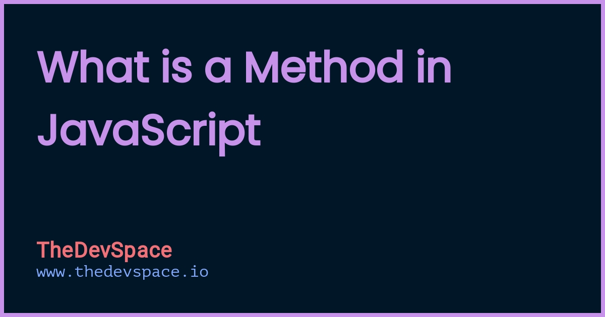

# Java Script Methods of Array





# 1.Method of Array Pop


# 2.Method of Array Push


# 3.Method of Array Shift

# 4.Method of Array unshift


# 5.Method of Array toString


# 6.Method of Array indexOf


# 7.Method of Array LastindexOf


```js
js
Copy to Clipboard
const numbers = [2, 5, 9, 2];
numbers.lastIndexOf(2); // 3
numbers.lastIndexOf(7); // -1
numbers.lastIndexOf(2, 3); // 3
numbers.lastIndexOf(2, 2); // 0
numbers.lastIndexOf(2, -2); // 0
numbers.lastIndexOf(2, -1); // 3
```

# 8.Method of Array join


```js
const elements = ['Fire', 'Air', 'Water'];

console.log(elements.join());
// Expected output: "Fire,Air,Water"

console.log(elements.join(''));
// Expected output: "FireAirWater"

console.log(elements.join('-'));
// Expected output: "Fire-Air-Water"
```

# 9.Method of Array concat

```js
The concat() method of Array instances is used to merge two or more arrays. This method does not change the existing arrays, but instead returns a new array.
```
 ```js
const array1 = ['a', 'b', 'c'];
const array2 = ['d', 'e', 'f'];
const array3 = array1.concat(array2);

console.log(array3);
// Expected output: Array ["a", "b", "c", "d", "e", "f"]
 ```

 # 10.Method of Array forEach
 ```js
 forEach() is a method in JavaScript that is used to loop over an array and execute a function on each element. The function can take up to three arguments - the current value of the element, the index of the element, and a reference to the array itself.
```
 

 
```js
const ratings = [5, 4, 5];
let sum = 0;

const sumFunction = async (a, b) => a + b;

ratings.forEach(async (rating) => {
  sum = await sumFunction(sum, rating);
});

console.log(sum);
// Naively expected output: 14
// Actual output: 0
```
# 11.Method of Array map
```js
map() method. .map() creates an array from calling a specific function on each item in the parent array. .map() is a non-mutating method that creates a new js array, as opposed to mutating methods, which only make changes to the calling array. This method can have many uses when working with arrays.
```


```js
const sweetArray = [2, 3, 4, 5, 35]
const sweeterArray = sweetArray.map(sweetItem => {
    return sweetItem * 2
})

console.log(sweeterArray)

Output
[ 4, 6, 8, 10, 70 ]
```

# 12.Method of Array reduce
```
The reduce() method is an iterative method. It runs a "reducer" callback function over all elements in the array, in ascending-index order, and accumulates them into a single value. Every time, the return value of callbackFn is passed into callbackFn again on next invocation as accumulator .
```


```js
const getMax = (a, b) => Math.max(a, b);

// callback is invoked for each element in the array starting at index 0
[1, 100].reduce(getMax, 50); // 100
[50].reduce(getMax, 10); // 50

// callback is invoked once for element at index 1
[1, 100].reduce(getMax); // 100

// callback is not invoked
[50].reduce(getMax); // 50
[].reduce(getMax, 1); // 1

[].reduce(getMax); // TypeError
```

# 13.Method of Array filter
 
```js
The filter() method creates a new array filled with elements that pass a test provided by a function. The filter() method does not execute the function for empty elements. The filter() method does not change the original array.
```


```js
const words = ['spray', 'elite', 'exuberant', 'destruction', 'present'];

const result = words.filter((word) => word.length > 6);

console.log(result);
// Expected output: Array ["exuberant", "destruction", "present"]
```

# 14.Method of Array toSorted
```js
The toSorted() method of Array instances is the copying version of the sort() method. It returns a new array with the elements sorted in ascending order.
```


```js
const months = ["Mar", "Jan", "Feb", "Dec"];
const sortedMonths = months.toSorted();
console.log(sortedMonths); // ['Dec', 'Feb', 'Jan', 'Mar']
console.log(months); // ['Mar', 'Jan', 'Feb', 'Dec']

const values = [1, 10, 21, 2];
const sortedValues = values.toSorted((a, b) => a - b);
console.log(sortedValues); // [1, 2, 10, 21]
console.log(values); // [1, 10, 21, 2]
```
# 15.Method of Array toReversed
 
```js
The toReversed() method transposes the elements of the calling array object in reverse order and returns a new array. When used on sparse arrays, the toReversed() method iterates empty slots as if they have the value undefined . The toReversed() method is generic.
```


```js
const items = [1, 2, 3];
console.log(items); // [1, 2, 3]

const reversedItems = items.toReversed();
console.log(reversedItems); // [3, 2, 1]
console.log(items); // [1, 2, 3]
```